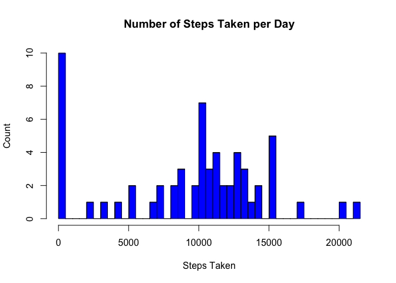
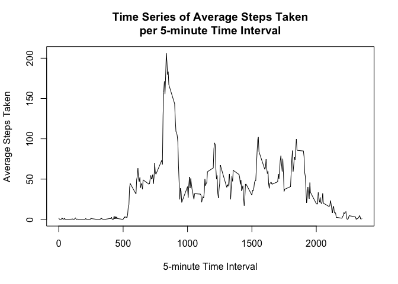
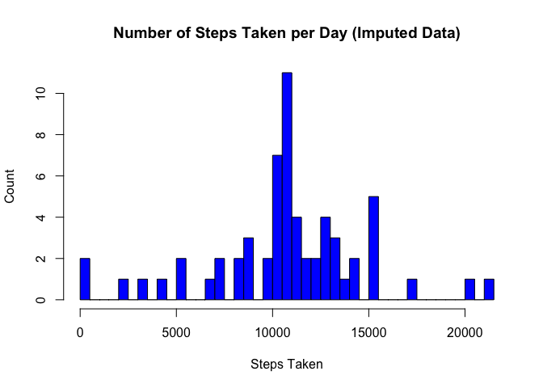
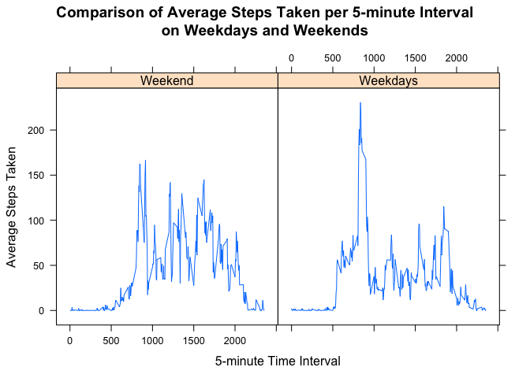

# Reproducible Research: Peer Assessment 1


## Loading and preprocessing the data

```r
# load necessary libraries
library(lattice)
library(plyr)
library(reshape)
```

```
## 
## Attaching package: 'reshape'
## 
## The following objects are masked from 'package:plyr':
## 
##     rename, round_any
```

```r
# set working directory
setwd("~/Documents/Coursera/Data Science Specialization/Reproducible Research/RepData_PeerAssessment1")

# read data directly from zip archive
data <- read.csv(unz("activity.zip", "activity.csv"), 
                 header = TRUE, quote = "\"", sep = ",", na.strings = "NA", 
                 colClasses = c("numeric", "character", "numeric"))
# convert date column to date data type
data$date <- as.Date(data$date, "%Y-%m-%d")
```


## What is mean total number of steps taken per day?

```r
# calculate total number of steps per day
sum_data <- ddply(data, c("date"), summarize, 
                  tot_steps = sum(steps, na.rm = TRUE))

# calculate median and mean number of steps per day
mean_steps <- mean(sum_data$tot_steps, na.rm = TRUE)
median_steps <- median(sum_data$tot_steps, na.rm = TRUE)
```

On average this person has taken ``9,354.23`` steps per day during the sample period. The median of the distribution is at ``10,395`` steps per day. The following histogram shows the distribution.


```r
# draw histogram of total number of steps per day
hist(sum_data$tot_steps, breaks = 50, 
     col = "blue", 
     main = "Number of Steps Taken per Day", 
     xlab = "Steps Taken", 
     ylab = "Count")
```

 


## What is the average daily activity pattern?

The time series plot below shows the distribution of steps taken per 5-minute time interval over the sample period.


```r
# calculate average number of steps per interval
interval_data <- ddply(data, c("interval"), summarize, 
                       mean_steps = mean(steps, na.rm = TRUE))

# draw time series plot
with (interval_data, plot(x = interval, 
                          y = mean_steps, 
                          type = "l", 
                          main = "Time Series of Average Steps Taken\nper 5-minute Time Interval", 
                          xlab = "5-minute Time Interval", 
                          ylab = "Average Steps Taken"))
```

 

```r
# identify most active time interval
interval_data_sort <- interval_data[order(-interval_data$mean_steps), ]
```

Over the course of the sample period the most steps were taken during time interval ``835``, an average of ``206.17`` steps.


## Imputing missing values


```r
# calculate number of rows with missing values
missing_data <- sum(is.na(data$steps))

# impute missing data as mean number of steps for respective time interval
data_impute <- merge(data, interval_data, by = "interval")
data_impute[is.na(data_impute$steps), "steps"] <- 
    data_impute[is.na(data_impute$steps), "mean_steps"]
```

A total number of ``2304`` measurements is missing data of steps taken. These values have now been replaced by the average number of steps taken for the respective 5-minute time interval over the sample period. The plot below shows the distribution of steps taken per day of the new imputed data.


```r
# calculate total number of steps per day for imputed data
sum_data_impute <- ddply(data_impute, c("date"), summarize, 
                         tot_steps = sum(steps, na.rm = TRUE))

# calculate median and mean number of steps per day
mean_steps_impute <- mean(sum_data_impute$tot_steps, na.rm = TRUE)
median_steps_impute <- median(sum_data_impute$tot_steps, na.rm = TRUE)

# draw histogram of total number of steps per day for imputed data
hist(sum_data_impute$tot_steps, breaks = 50, 
     col = "blue", 
     main = "Number of Steps Taken per Day (Imputed Data)", 
     xlab = "Steps Taken", 
     ylab = "Count")
```

 

The average number of steps taken has risen from ``9,354.23`` steps in the original data to ``10,766.19`` steps in the imputed data, the median from ``10,395`` steps in the original data to ``10,766`` steps in the imputed data. This is a logical result of replacing missing values, which do not add to the number of steps, by (albeit) small numbers from the average number of steps per time interval.


## Are there differences in activity patterns between weekdays and weekends?


```r
# create new factor variable to distinguish weekdays and weekends
data_impute$weekend <- weekdays(data_impute$date) %in% c("Saturday", "Sunday")

# calculate average number of steps per interval for weekdays and weekends
interval_data_weekend <- ddply(data_impute[data_impute$weekend == TRUE, ], 
                               c("interval"), summarize, 
                               mean_steps = mean(steps, na.rm = TRUE))
interval_data_weekdays <- ddply(data_impute[data_impute$weekend != TRUE, ], 
                                c("interval"), summarize, 
                                mean_steps = mean(steps, na.rm = TRUE))
interval_data2 <- merge(interval_data_weekend, interval_data_weekdays, 
                        by = "interval")
colnames(interval_data2) <- c("interval", "Weekend", "Weekdays")
interval_data2 <- melt(interval_data2, id = "interval")

# draw time series plots
xyplot(value ~ interval | variable, data = interval_data2, 
       type="l", 
       main="Comparison of Average Steps Taken per 5-minute Interval\non Weekdays and Weekends", 
       ylab="Average Steps Taken", 
       xlab="5-minute Time Interval")
```

 

As it turns out the activity patterns between weekdays and weekends are different. On weekdays, a peak of activity takes place in the morning, whereas on the weekends the activity is spread out more evenly over the day. Also, on weekends activity starts later in the morning and ends later in the evening.
